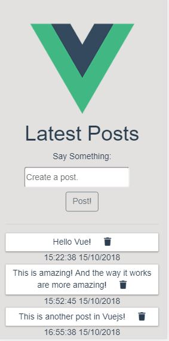
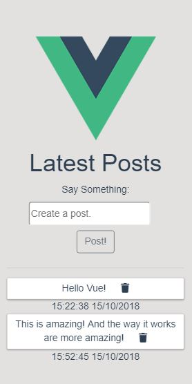

#Step1: Download or Clone the project.

#Step2: NPM install (It will install all the dependencies of the backend.)

#Step3: cd client and follow the following instructions-

# client

#Step4:

## Project setup

```
npm install
```

#Step4:

### Compiles and hot-reloads for development

```
npm run serve
```

### Compiles and minifies for production

```
npm run build
```

### Run your tests

```
npm run test
```

### Lints and fixes files

```
npm run lint
```

#Snaps of the App. 1.


2.


3.

