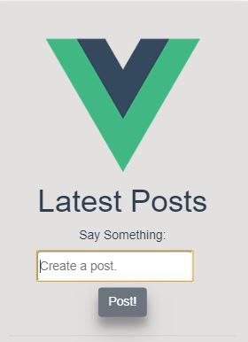

<h4>Download or clone the project.</h4>

<h4>NPM install (It will install all the dependencies of the backend.)</h4>

<h4>cd client and follow the following instructions-</h4>

# client
## Project setup

```
npm install
```

### Compiles and hot-reloads for development

```
npm run serve
```

### Compiles and minifies for production

```
npm run build
```

### Run your tests

```
npm run test
```

### Lints and fixes files

```
npm run lint
```

# Snaps of the App. 
<h3>Loading All the posts of the app</h3>.<br/>
<br/>
<h3>A little bit CSS helps app to look good.</h3><br/>
<br/>
<h3>When user click on the delete icon. It wil remove from the list as well as from the DB.</h3><br/>
<br/>

# Notice
I have ignored my <strong>config/keys.js</strong> So you can add your own DB for storing the posts.
